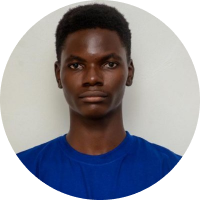
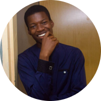
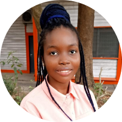

<html lang="en">
<head>
    <meta charset="UTF-8">
    <meta http-equiv="X-UA-Compatible" content="IE=edge">
    <meta name="viewport" content="width=device-width, initial-scale=1.0">
    <title>Meet the Team</title>
    <link rel="stylesheet" href="./mtt_styles.css">
    <link href="https://fonts.googleapis.com/css2?family=Poppins:wght@200&display=swap" rel="stylesheet">
  
</head>
<body>
    <h1>Meet The Team</h1>
    

        

            
            
Daniel Sumah

            
Founder | Web Development Tutor

            
University of Lagos, Akoka

            <a href="https://www.linkedin.com/mwlite/in/daniel-sumah-44796368" target="_blank"><button>View on LinkedIn</button></a>
        

   

            
            
Promise Shittu

            
CoFounder | Python Tutor

            
Obafemi Awolowo University, Ife

            <a href="https://www.linkedin.com/in/promise-shittu-436951124" target="_blank"><button>View on LinkedIn</button></a>
        

  

            
            
Zion Shittu

            
Public Relations Officer

            
Obafemi Awolowo University, Ife

            <a href="https://www.linkedin.com/in/zion-shittu-9703011a1" target="_blank"><button>View on LinkedIn</button></a>
        

   

            
            
Ayodeji Areago

            
Brand Manager | Graphic Design Tutor

            
Obafemi Awolowo University, Ife

            <a href="https://www.linkedin.com/in/ayodeji-areago-a6a33611b" target="_blank"><button>View on LinkedIn</button></a>
        

   

            
            
Precious Asunmo

            
Public Relations Officer

            
Obafemi Awolowo University, Ife

            <a href="https://www.linkedin.com/in/precious-asunmo-7349251a2" target="_blank"><button>View on LinkedIn</button></a>
        

   

            
            
Chidera Umeadi

            
Web Developer

            
University of Lagos, Akoka

            <a href="https://www.linkedin.com/in/chidera-umeadi-76a9751a6" target="_blank"><button>View on LinkedIn</button></a>
        

        
   

</body>
</html>
